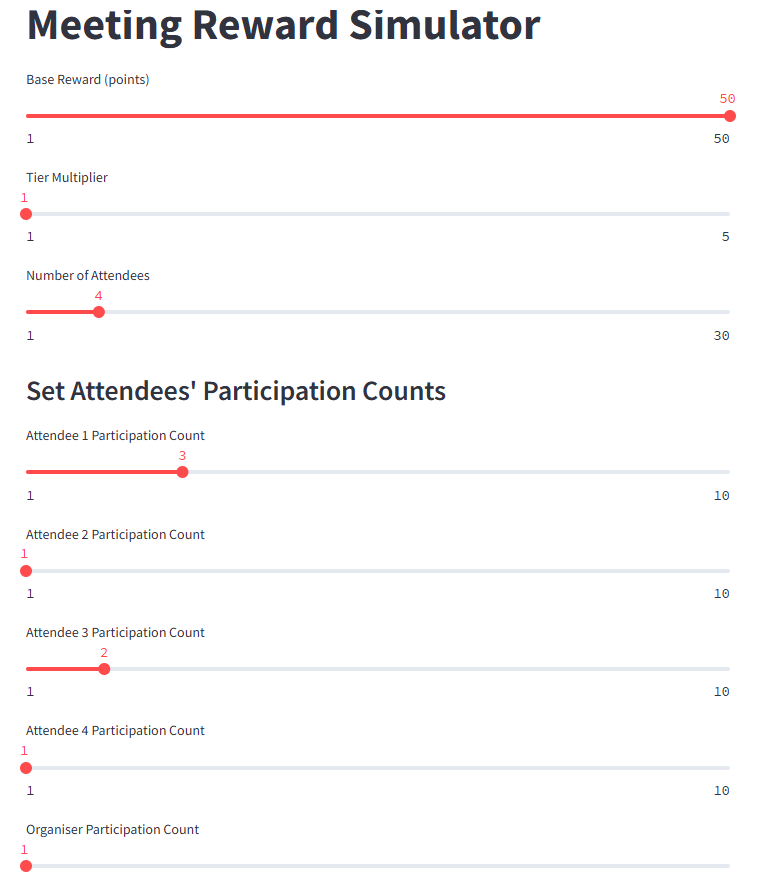

 

# Meeting Reward Simulator

A simple Streamlit app to simulate tiered rewards for event organisers and attendees based on participation and decay rules.

## How it works

- *Base Reward*: Adjustable starting points per event.
- *Tier Multiplier*: Higher tiers yield greater rewards.
- *Decay System*: Rewards decrease as participants attend more events, with a floor at 20% of the original reward.
- *Organiser Bonus*: Organisers receive 50% of the total points of attendees (also subject to decay).

## Features

- Easy sliders to adjust base reward, tier multipliers, and participation counts.
- Real-time calculation of rewards for both organisers and attendees.
- Fair decay system ensuring sustainable distribution of rewards.

## Setup Instructions

1. Clone this repository or download the files.
2. Install Streamlit if you don't have it:
   ```bash
   pip install streamlit
